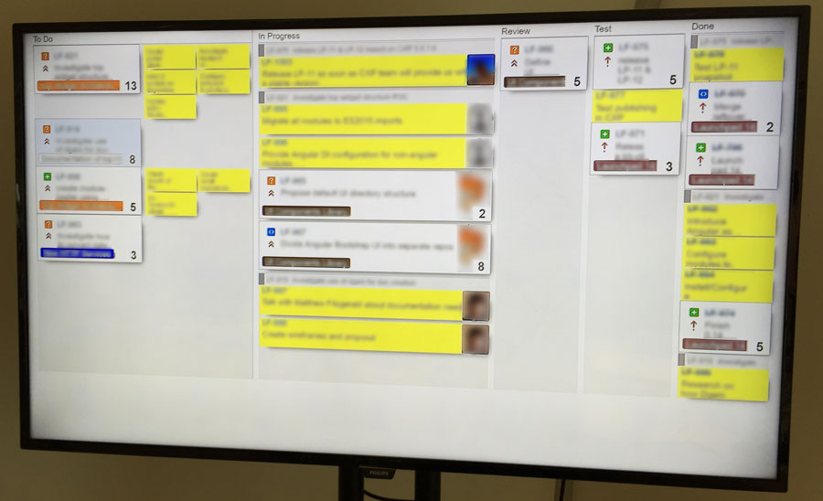

CSS styles to customize the [JIRA](https://www.atlassian.com/software/jira) scrum board.

These styles can be applied to the page thourgh a Chrome extension like [Stylish](https://chrome.google.com/webstore/detail/stylish/fjnbnpbmkenffdnngjfgmeleoegfcffe?hl=en), which allows you to addyour own CSS rules to customize websites.

- The benefit gained with these customizations is that with them, most of the times all the user stories for the current sprint fit in in our 47" TV screen. Having all the information on sight increases awareness in the team about what is still in 'To Do'.
- I also styled sub-tasks with a post-it-like yellow, made them smaller and made them stack to the right of their corresponding issues. This adds some clarity.
- We made the photograph bigger on the stories that are 'In Progress', and hid them from the other tickets. This makes it more clear who is currently working on what.

We used these styles in the TV screen that we use as scrum board. We do the standups in front of this monitor, but every developer has of course access to the unstyled version of JIRA in their computers. The final result feels like a physical index-cards based scrum board, but with the benefit that you don't have to keep it in sync with JIRA.

I did it as a quick hack, so the CSS code is terrible and there are some imperfections here and there. Maybe I'll tidy it up at some point!

Here is the final result (text and avatars blurred for privacy).

